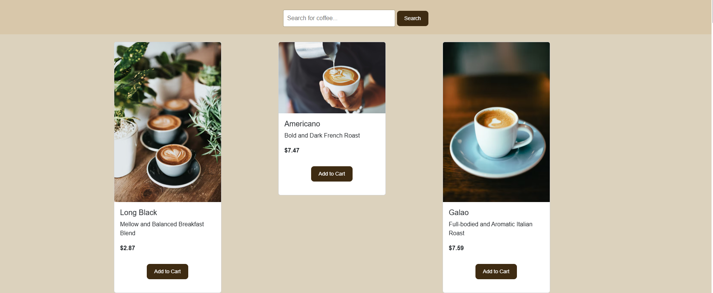
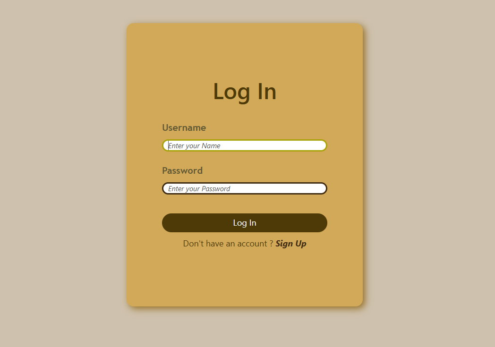
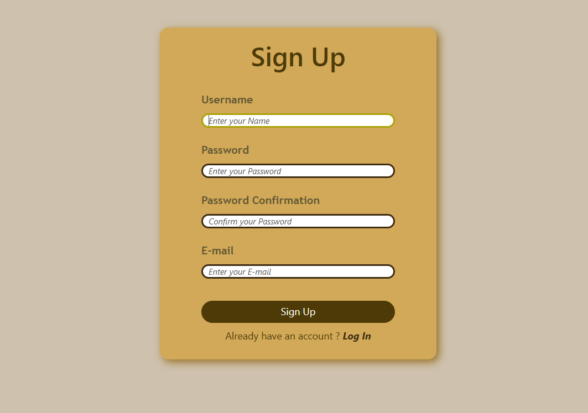
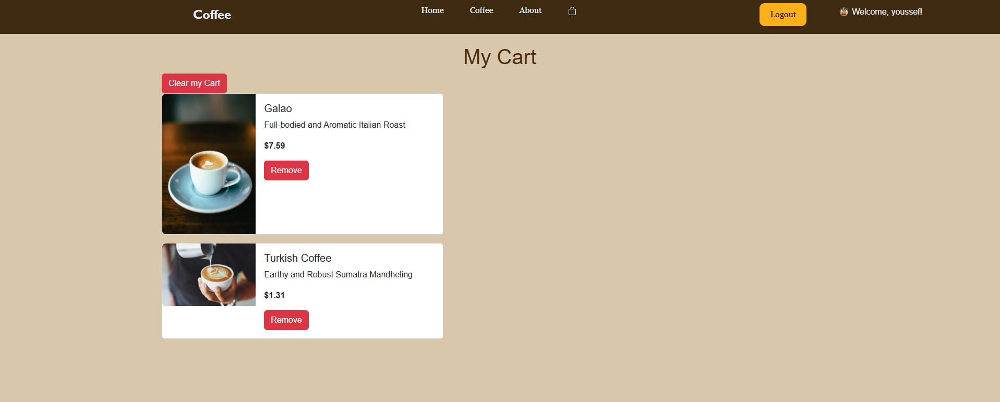

# ☕ Coffee Shop Web Application

A modern, elegant **Coffee Shop web application** built with **Flask**
that allows users to browse coffee items, register & log in, manage a
shopping cart, and enjoy a smooth, dynamic experience.

This project focuses on **clean backend logic**, **secure user
sessions**, and a **simple but scalable cart system** using SQLite.

---

## 🌟 Features

- 🔐 **User Authentication**
  - Register & Login system
  - Secure session-based authentication
  - Logout functionality
- ☕ **Coffee Catalog**
  - Browse all coffee items
  - Images, descriptions, and prices
  - Clean card-based UI
- 🛒 **Shopping Cart**
  - Add coffee items to cart
  - Remove specific items
  - Clear cart
  - Cart is unique per user
  - Cart persists using database + sessions
- 🔍 **Search Functionality**
  - Filter coffee items dynamically
  - Search by coffee name
- ⚙️ **Backend Logic**
  - SQLite database
  - JSON-based cart storage
  - Clean Flask routes
  - Jinja templating system

---

## 🧠 How It Works

1.  Users log in or register
2.  Flask creates a unique session per user
3.  Each user has a separate cart
4.  Cart data is stored as JSON in SQLite
5.  Coffee items are fetched dynamically and rendered using Jinja

---

## 🛠️ Technologies Used

- Backend: Flask (Python)
- Frontend: HTML, CSS, Bootstrap
- Database: SQLite3
- Templating: Jinja2
- Sessions: Flask Sessions

---

## 📂 Project Structure
Coffee-Shop/
│
├── app.py
├── coffee.db
├── users.db
│
├── templates/
│   ├── layout.html
│   ├── index.html
│   ├── login.html
│   ├── register.html
│   ├── coffee.html
│   └── cart.html
│
├── static/
│   ├── css/
│   │   ├── main.css
│   │   └── cart.css
│   └── images/
│
├── README.md
│
└── Project Overview

---

## 🚀 How to Run

1.  Clone the project
2.  Install Flask
3.  Run `python app.py`
4.  Open http://127.0.0.1:5000

---

## 🔐 Security Notes

- Password hashing recommended
- Sessions secured using SECRET_KEY
- SQL injection protected via parameterized queries

---

## 🚧 Future Improvements

- Quantity per item
- Checkout system
- Order history
- Responsive UI
- User reviews
- Handling Cart Operation

---

## 📸 Screenshots
#### Home Page

#### Search Page

#### Log In Page

#### Sign Up Page

#### Cart Page

## 👨‍💻 Author

_Youssef Ahmed Zaki_\
Backend Developer \| Flask Enthusiast

---

☕ Code brewed with passion.
